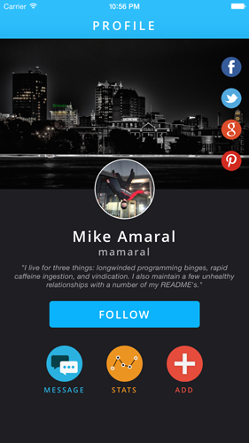
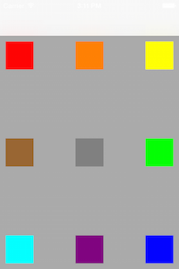
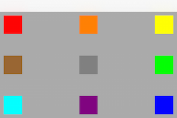
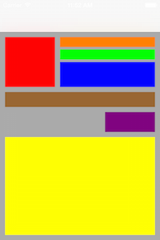
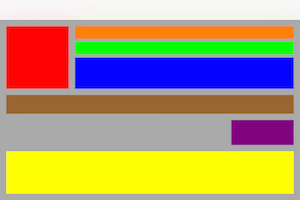
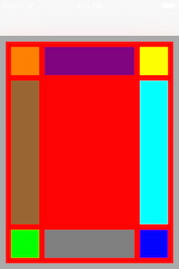
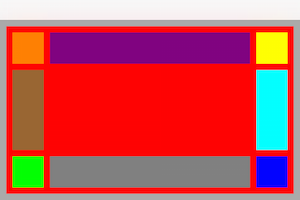
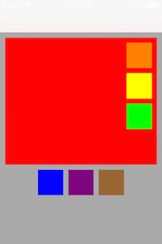
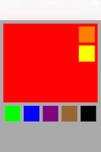

## Façade

[](http://doge.mit-license.org) [](https://travis-ci.org/mamaral/Facade/) [](https://img.shields.io/cocoapods/v/Facade.svg) [](https://coveralls.io/r/mamaral/Facade?branch=master) [](https://github.com/Carthage/Carthage)

## What is it?

Façade is a `UIView` category allowing you to build your UI in *real-world terms*, in the same way you would explain the layout to someone in conversation. It is a conglomeration of convenience methods wrapping lots of annoying and tedius frame algebra into a human-readable format. Because of this, it's *lightweight* and *flexible* enough to allow you to ***build great looking UI's quickly and easily define unique layout experiences based on device orientation or type.***



```objective-c
[_headerImageView anchorTopCenterFillingWidthWithLeftAndRightPadding:0 topPadding:0 height:250];

NSArray *shareButtons = @[_facebookButton, _twitterButton, _googleButton, _pinterestButton];
[_headerImageView groupVertically:shareButtons centerRightWithRightPadding:7 spacing:7 width:45 height:45];

[_avatarImageView alignUnder:_headerImageView matchingCenterWithTopPadding:-50 width:100 height:100];
[_nameLabel alignUnder:_avatarImageView centeredFillingWidthWithLeftAndRightPadding:7 topPadding:14 height:28];
[_usernameLabel alignUnder:_nameLabel centeredFillingWidthWithLeftAndRightPadding:7 topPadding:2 height:19];

[_bioLabel sizeToFit];
[_bioLabel alignUnder:_usernameLabel centeredFillingWidthWithLeftAndRightPadding:15 topPadding:10 height:CGRectGetHeight(_bioLabel.frame)];

[_followButton alignUnder:_bioLabel matchingCenterWithTopPadding:20 width:250 height:44];

[_scrollView groupHorizontally:@[_messageButton, _statsButton, _addButton] centeredUnderView:_followButton topPadding:30 spacing:40 width:60 height:60];
[_messageLabel alignUnder:_messageButton matchingCenterWithTopPadding:7 width:80 height:13];
[_statsLabel alignUnder:_statsButton matchingCenterWithTopPadding:7 width:80 height:13];
[_addLabel alignUnder:_addButton matchingCenterWithTopPadding:7 width:80 height:13];
```

## How Do I Use It?

1. Add `pod 'Facade'` to your Podfile, and run `pod install`
2. Import `UIView+Facade.h` in your view controller.
3. Create your view components like you normally would, customize them, and add them as subviews to their appropriate superview. ***Don't set their frames*** - let us handle that for you.
2. When appropriate, such as in your view controller's `layoutSubviews` method, call the applicable `UIView+Facade` convenience methods to define how you want your UI to be laid out.

## Creating Anchor Views

Many UI layouts *"start"* with a view anchored to the top/corner of the screen, such as a profile view with an avatar in the top-left corner. Doing something like this is easy with Façade - simply tell the view where to anchor itself, and provide the applicable padding/size parameters, and it will do the rest for you. Doing this in `viewWillLayoutSubviews` also allows Façade to keep this layout consistent in both orientations, as shown below:


```objective-c
- (void)viewWillLayoutSubviews {
    [super viewWillLayoutSubviews];

    [self layoutFacade];
}

- (void)layoutFacade {
    CGFloat padding = 10;
    CGFloat size = 50;

    [_redView anchorTopLeftWithLeftPadding:padding topPadding:padding width:size height:size];
    [_orangeView anchorTopCenterWithTopPadding:padding width:size height:size];
    [_yellowView anchorTopRightWithRightPadding:padding topPadding:padding width:size height:size];
    [_greenView anchorCenterRightWithRightPadding:padding width:size height:size];
    [_blueView anchorBottomRightWithRightPadding:padding bottomPadding:padding width:size height:size];
    [_purpleView anchorBottomCenterWithBottomPadding:padding width:size height:size];
    [_cyanView anchorBottomLeftWithLeftPadding:padding bottomPadding:padding width:size height:size];
    [_brownView anchorCenterLeftWithLeftPadding:padding width:size height:size];
    [_grayView anchorInCenterWithWidth:size height:size];
}
```




## Relatives

While most layouts start with one or more anchor views, the rest of the components are typically laid out ***relative*** to other sibling views and often their sizes are dependant both on these sibling views and their superview. We've compiled the most common relative layout types to make this process as easy as possible. Here are a few examples, showing the results in both orientations:

```objective-c
[_redView anchorTopLeftWithLeftPadding:10 topPadding:10 width:100 height:100];
[_orangeView alignToTheRightOf:_redView matchingTopAndFillingWidthWithLeftAndRightPadding:10 height:20];
[_greenView alignUnder:_orangeView matchingLeftAndFillingWidthWithRightPadding:10 topPadding:5 height:20];
[_blueView alignUnder:_greenView matchingLeftAndFillingWidthWithRightPadding:10 topPadding:5 height:50];
[_brownView alignUnder:_redView matchingLeftAndFillingWidthWithRightPadding:10 topPadding:10 height:30];
[_purpleView alignUnder:_brownView matchingRightWithTopPadding:10 width:100 height:40];
[_yellowView alignUnder:_purpleView centeredFillingWidthAndHeightWithLeftAndRightPadding:10 topAndBottomPadding:10];
```




You can also position views *between* two views vertically or horizontally:

```objective-c
[_purpleView alignBetweenLeft:_orangeView andRight:_yellowView matchingTopWithLeftAndRightPadding:10 height:50];
[_brownView alignBetweenTop:_orangeView andBottom:_greenView matchingLeftWithTopAndBottomPadding:10 width:50];
[_grayView alignBetweenLeft:_greenView andRight:_blueView matchingTopWithLeftAndRightPadding:10 height:50];
[_cyanView alignBetweenTop:_yellowView andBottom:_blueView matchingLeftWithTopAndBottomPadding:10 width:50];
```




## View Groups

Sometimes you want a number of view components to be *grouped* together and have this group as a whole be laid out relative to another view. A common example of this would be share buttons - perhaps on top of an image there's share icons for facebook, pinterest, twitter, etc. This can easily be achieved by telling the appropriate ***superview*** to group an array of child views with a particular layout, padding, and sizes. Here's two-examples-in-one:

```objective-c
[_redView groupVertically:@[_orangeView, _yellowView, _greenView] inUpperRightWithRightPadding:10 topPadding:10 spacing:10 width:50 height:50];
[self.view groupHorizontally:@[_blueView, _purpleView, _brownView] centeredUnderView:_redView topPadding:10 spacing:10 width:50 height:50];
```



The cool part of this is that it allows you to add, remove, or reorganize views to a group without having to recalculate all of the frames for each.

```objective-c
[_redView groupVertically:@[_orangeView, _yellowView] inUpperRightWithRightPadding:10 top:10 spacing:10 width:50 height:50];
[self.view groupHorizontally:@[_greenView, _blueView, _purpleView, _brownView, _blackView] centeredUnderView:_redView topPadding:10 spacing:10 width:50 height:50];
```



## Considerations

- I simply don't have the time to consider ***every single*** layout scenario, and thus ***it might not be a perfect fit for every situation***. I invested quite some time looking at screenshot after screenshot from countless mobile apps to see how each view lays out its components, and in trying to keep the API as simple as possible, certain assumptions are made that in my opinion will be ***sufficient for the vast majority of mobile UIs***, but your mileage may vary. I've almost certainly missed implementing methods that might also be commonly used - and if I did please open an issue or a pull request!
- I know the APIs are quite verbose - this is by design. I intentionally chose readability, clarity, and specificity over succinctness because in this case I feel choosing the methods you'll need to achieve your desired goals will be easier as you won't need to rely on the documentation, and maintenance will be much more pleasnt as anyone looking at the code will very-quickly know exactly that it means.

## Community

- If you want to contribute, open a pull request. Please do your best to keep the style/formatting consistent with the current project and MAKE SURE TO ADD TESTS!

- If you have questions, feature requests, etc., I would prefer if you created an issue rather than email me directly.


## License

This project is made available under the MIT license. See `LICENSE.txt` for details.
